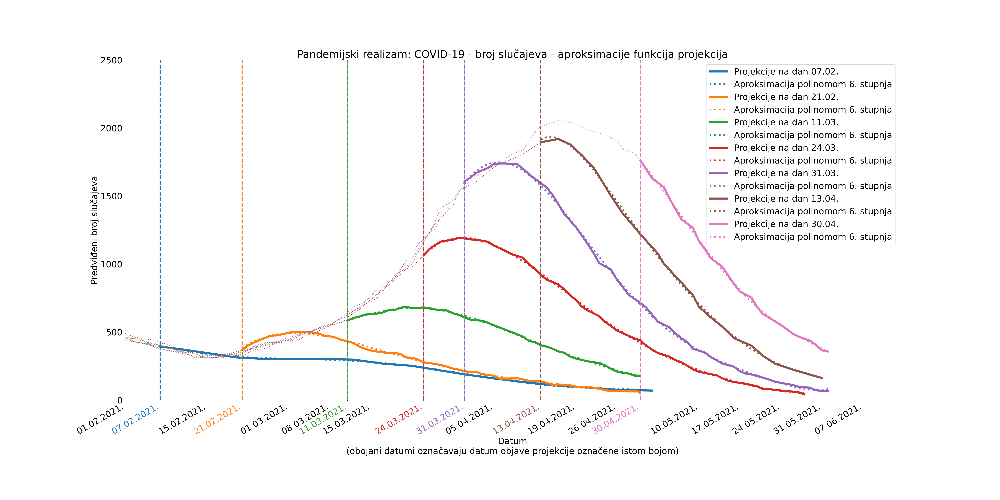
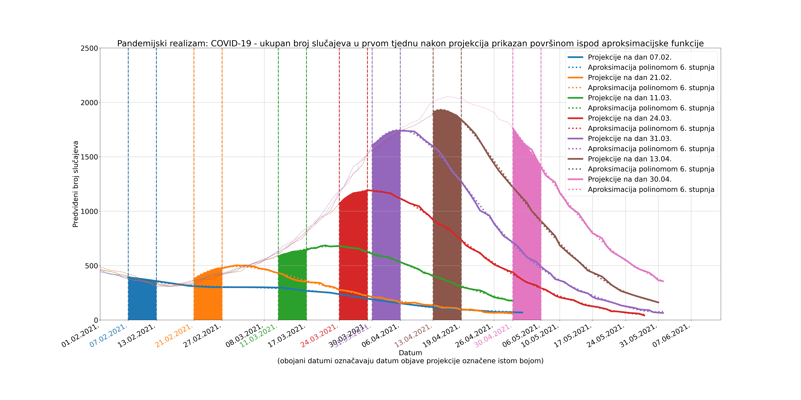

## Pandemijski realizam?

Za početak, evo jedan graf:


*Slika 1. Animirana ilustracija evolucije predikcija budućeg broja COVID19 slučajeva u Hrvatskoj prema modelu Nenada Bakića. Generirano 9.5.2021.*

Jedan od glavnih alata kojima pandemijski realisti uvjeravaju cijelu Hrvatsku da je sve pod kontrolom su Bakićev model i njegove prognoze budućeg tijeka pandemije. Koja je metodologija iza ovog modela, koliko su zapravo točne njegove projekcije i kakve su u usporedbi s ostalim modelima? Na [stranicama pandemijskog realizma](https://pandemijskirealizam.net/) možemo naučiti samo da je taj model najbolji i jedini koji postoji uz [model velikog IHME-a](https://covid19.healthdata.org/croatia).

Danas je već prošlo dovoljno vremena od početka trećeg vala u Hrvatskoj da bismo mogli usporediti dane predikcije sa stvarnošću. Kad imamo stvarne podatke, više ne moramo raspravljati o tome jesu li modeli bili dobri ili nisu, možemo to objektivno provjeriti.

Jedan od načina za evaluaciju modela koji se bave projekcijama broja slučajeva i broja umrlih od COVID19 u Europi je [European Covid-19 Forecast Hub](https://covid19forecasthub.eu/), portal koji ne samo da sadrži projekcije desetak dodatnih modela za Hrvatsku, već nudi i alate za njihovo objektivno uspoređivanje.

Nažalost, Bakićev model nije javno dostupan pa ga je malo kompliciranije usporediti s ostalim modelima. Kad bismo imali pristup strojno čitljivim podacima, mogli bismo ih lako prebaciti u format potreban za evaluaciju na Covid19 forecast hubu i bili bismo gotovi. Što imamo umjesto toga? Imamo slike Bakićevih grafova i to je to. Dobro, sve što trebamo možemo iščitati iz grafova, ali ovaj prvi pristup bio bi puno jednostavniji.

### Iscjeđivanje podataka iz grafova

Sve što nam treba za ovaj korak su: slike grafova, printer, ravnalo, olovka, Excel tablica, mirna ruka i par sati slobodnog vremena. Bolja opcija je npr. [WebPlotDigitizer](https://automeris.io/WebPlotDigitizer/), mirna ruka i par sati slobodnog vremena.


*Slika 2. U lijevom stupcu prikazane su slike grafova preuzete sa [stranica pandemijskog realizma](https://pandemijskirealizam.net/), dok desni stupac prikazuje rekonstrukciju istih grafova iz podataka izvučenih iz slika. Zanimaju nas dijelovi grafova s desne strane crtkane vertikalne linije - ti dijelovi predstavljaju prognoze. Lijevi dijelovi grafa predstavljaju prošlost i nisu dio evaluacije modela te samim time ne moramo biti precizni pri izvlačenju podataka iz tih dijelova.*

Budući da korišten alat za ekstrakciju podataka iz grafova nije savršen i kako kvaliteta slika nije baš najbolja (vidljivi su artefakti jpg kompresije), ekstrahirani podaci nisu 100% ekvivalentni originalnim podacima te su zbog toga su moguće greške i blaga odstupanja.

### Strojno čitljivi podaci

Podaci iz grafova dostupni su u .csv formatu u direktoriju [./code/csvs/](./code/csvs/).

### Aproksimacija izvučenih funkcija

Kako bismo mogli dobiti vrijednosti projekcija na neki proizvoljan datum odabran s desne strane jedne od vertikalnih crtkanih linija (neki datum nakon što su projekcije objavljene), aproksimirat ćemo svaku od projekcija polinonom n-tog stupnja tako da minimiziramo sumu kvadrata odstupanja aproksimacijske funkcije od stvarnih podataka, ili za one koji preferiraju univerzalni jezik matematike:


gdje *y_i* predstavlja vrijednost predviđenog broja slučajeva iščitanu iz grafa na dan *x_i*, a *theta* predstavlja vektor koeficijenata polinoma *f*.



*Slika 3. Prikaz projekcije i njihovih aproksimacija polinomima 6. stupnja. Aproksimacije su prikazane točkastim linijama.*

### Što se točno evaluira?

[European Covid-19 Forecast Hub](https://covid19forecasthub.eu/) omogućava svima koji se bave modeliranjem pandemije slanje svojih projekcija svakog ponedjeljka na evaluaciju i usporedbu s ostalim modelima. Moguće je prijaviti projekcije predviđenih broja slučajeva ili predviđenih broja umrlih (ili i jedno i drugo) na tjednoj razini, tj. potrebno je poslati predviđenih broj novih slučajeva [1, 2, 3 ili 4 tjedna unaprijed](https://github.com/epiforecasts/covid19-forecast-hub-europe/wiki/Targets-and-horizons). Pristignute projekcije evaluiraju se na kraju tjedna kad stignu točni podaci.

S obzirom na to da je spomenuti portal otvorenog koda, svatko tko želi može vidjeti kako točno radi te klonirati repozitorij i izvrtiti evaluaciju lokalno, na svom računalu. To je upravo ono što ćemo napraviti ovdje, budući da retroaktivno slanje podataka na evaluaciju (naravno) nije dopušteno.

### Generiranje projekcija za evaluaciju

Nakon što smo uspješno aproksimirali projekcije izvučene iz slika grafova sa stranica pandemijskog realizma, potrebno je pomoću tih funkcija izračunati predviđeni broj novih slučajeva na tjednoj razini, kao što je spomenuto iznad. Ukupan broj novih slučajeva u nekom danom tjednu jednak je površini ispod funkcije dnevnih slučajeva, kada tu funkciju promatramo od početka do kraja tog danog tjedna. Kako izračunati površinu ispod funkcije? Točno! Koristeći najdraži matematički alat svakog srednjoškolca - integriranje.



*Slika 4. Ukupan broj slučajeva u prvom tjednu nakon objavljivanja projekcija, prikazan površinom ispod aproksimacijske funkcije.*

Prema primjeru opisanom na stranicama [European Covid-19 Forecast Huba](https://github.com/epiforecasts/covid19-forecast-hub-europe/wiki/Targets-and-horizons), projekcije za jedan tjedan unaprijed, objavljene 07.02. (nedjelja), trebaju uključivati 7 dana, od nedjelje 07.02. do subote 13.02. i predaju se u ponedjeljak 08.02. Prateći te specifikacije i koristeći metodu opisanu iznad, možemo generirati sljedeće projekcije:


*Slika 5. Vizualizacija projekcije ukupnog broja slučajeva jedan tjedan unaprijed.*


*Slika 6. Vizualizacija projekcije ukupnog broja slučajeva dva tjedna unaprijed.*


*Slika 7. Vizualizacija projekcije ukupnog broja slučajeva tri tjedna unaprijed.*


*Slika 8. Vizualizacija projekcije ukupnog broja slučajeva četiri tjedna unaprijed.*

Sažeti pregled estimiranih projekcija prikazan je u sljedećoj tablici:

| Datum objave projekcije | Datum slanja na <br />evaluaciju (retroaktivno), <br />forecast_date | Projekcija<br />1 tjedan unaprijed<br />(ukupan broj novih<br />slučajeva tog tjedna) | Projekcija<br />2 tjedna unaprijed | Projekcija<br />3 tjedna unaprijed | Projekcija<br />4 tjedna unaprijed |
| ----------------------- | ------------------------------------------------------------ | ------------------------------------------------------------ | ---------------------------------- | ---------------------------------- | ---------------------------------- |
| 07.02.2021.             | 08.02.2021.                                                  | 2584.79                                                      | 2302.85                            | 2165.60                            | 2105.97                            |
| 21.02.2021.             | 22.02.2021.                                                  | 3144.95                                                      | 3408.49                            | 3059.42                            | 2485.87                            |
| 11.03.2021.             | 15.03.2021. *                                                | 4581.55                                                      | 4690.55                            | 4273.81                            | 3522.58                            |
| 24.03.2021.             | 22.03.2021. **                                               | 7522.06                                                      | 8278.81                            | 7576.27                            | 6171.92                            |
| 31.03.2021.             | 29.03.2021. **                                               | 11174.99                                                     | 12056.43                           | 10521.31                           | 7950.53                            |
| 13.04.2021.             | 12.04.2021. **                                               | 13345.64                                                     | 11969.56                           | 9198.07                            | 6480.04                            |
| 30.04.2021.             | 26.04.2021. *** (ignorirano)                                 | 12826.76                                                     | 10109.97                           | 7279.91                            | 4949.25                            |

Izvrsno! Sad samo trebamo spremiti ove projekcije u formatu definiranom na [European Covid-19 Forecast Hubu](https://github.com/epiforecasts/covid19-forecast-hub-europe/wiki/Forecast-format) i brzo ćemo moći usporediti ovaj model s ostalim nepostojećim modelima.

Projekcije označene s ** objavljene su nakon službenog datuma evaluacije, što znači da je model u tom trenutku imao pristup stvarnom broju slučajeva te usporedba s ostalim modelima nije u potpunosti pravedna. Projekcija označena s *** objavljena je 4 dana nakon službenog datuma evaluacije te iz tog razloga nije uključena u evaluaciju. S druge strane, projekcija označena s * objavljena je 4 dana prije službenog datuma evaluacije.

### Intervali pouzdanosti

Budući da ne znamo koji su intervali pouzdanosti u grafovima objavljenim na stranicama pandemijskog realizma, a potrebni su za evaluaciju, pretpostavit ćemo da projekcije navedene u tablici iznad predstavljaju srednje vrijednosti normalne distribucije, dok standardnu devijaciju definiramo kao


gdje *t* označava redni broj tjedna (1, 2, 3 ili 4). Time pretpostavljamo da pouzdanost projekcije modela pada kad gledamo dalje u budućnost.

## Rezultati evaluacije

Koristeći alate sa spomenutog repozitorija možemo vizualizirati projekcije svih modela koji su svoje projekcije poslali na vrijeme na evaluaciju. Kako ovu analizu radimo lokalno, možemo retroaktivno ubaciti i projekcije Bakićevog modela te ih međusobno usporediti. U donjim slikama crnom bojom prikazani su stvarni podaci broja slučajeva za svaki od tjedana, plava linija označava projekcije, dok osjenčani dijelovi označavaju 50% i 90% interval pouzdanosti. Datum evaluacije naveden je u naslovu.

Detalji i metodologija ostalih modela mogu se pronaći na [ovom linku](https://covid19forecasthub.eu/visualisation.html).

#### Vizualizacije predikcija 12.04.


#### Vizualizacije predikcija 29.03.


#### Vizualizacije predikcija 22.03.


#### Vizualizacije predikcija 15.03.


#### Vizualizacije predikcija 21.02.


#### Vizualizacije predikcija 08.02.


#### Korištene metrike

> - Relative skill is a metric based on the weighted interval score (WIS) that is using a ‘pairwise comparison tournament’. All pairs of forecasters are compared against each other in terms of the weighted interval score. The mean score of both models based on the set of common targets for which both models have made a prediction are calculated to obtain mean score ratios. The relative skill is the geometric mean of these mean score ratios. Smaller values are better and a value smaller than one means that the model beats the average forecasting model.
> - The weighted interval score is a proper scoring rule (meaning you can’t cheat it) suited to scoring forecasts in an interval format. It has three components: sharpness, underprediction and overprediction. Sharpness is the width of the prediction interval. Over- and underprediction only come into play if the prediction interval does not cover the true value. They are the absolute value of the difference between the upper or lower bound of the prediction interval (depending on whether the forecast is too high or too low).
> - coverage deviation is the average difference between nominal and empirical interval coverage. Say the 50 percent prediction interval covers only 20 percent of all true values, then the coverage deviation is 0.5 - 0.2 = -0.3. The coverage deviation value in the table is calculated by averaging over the coverage deviation calculated for all possible prediction intervals. If the value is negative you have covered less then you should. If it is positve, then the forecasts could be a little more confident.
> - bias is a measure between -1 and 1 that expresses the tendency to underpredict (-1) or overpredict (1). In contrast to the over- and underprediction components of the WIS it is bound between -1 and 1 and cannot go to infinity. It is therefore less susceptible to outliers.
> - aem is the absolute error of the median forecasts. A high aem means the median forecasts tend to be far away from the true values.


### Projekcija 1 tjedan unaprijed

| rank | model                   | rel_skill | target_variable | wis     | sharpness | underpred | overpred | bias  | aem     | 50% Cov. | 95% Cov. |
| ---- | ----------------------- | --------- | --------------- | ------- | --------- | --------- | -------- | ----- | ------- | -------- | -------- |
| 1    | epiforecasts-EpiExpert  | 0.53      | inc case        | 310.46  | 189.66    | 120.79    | 0        | -0.5  | 512.53  | 0.5      | 1        |
| 2    | UMass-SemiMech          | 0.67      | inc case        | 1054.52 | 837.98    | 116.17    | 100.36   | -0.07 | 1492.33 | 1        | 1        |
| 3    | EuroCOVIDhub-ensemble   | 0.77      | inc case        | 839.77  | 531.03    | 86.75     | 221.99   | -0.08 | 1263.72 | 0.83     | 1        |
| 4    | epiforecasts-EpiNow2    | 0.89      | inc case        | 1018.61 | 407.99    | 72.2      | 538.42   | 0.12  | 1373.5  | 0.83     | 0.83     |
| 5    | Priesemann-bayes        | 0.97      | inc case        | 1242.68 | 507.03    | 1.03      | 734.62   | 0.49  | 1915.06 | 0.5      | 1        |
| 6    | LANL-GrowthRate         | 1.02      | inc case        | 808.33  | 522.62    | 252.19    | 33.52    | -0.39 | 1402.15 | 0.7      | 1        |
| 7    | IEM_Health-CovidProject | 1.12      | inc case        | 1218.11 | 748.75    | 224.19    | 245.16   | -0.15 | 1975.21 | 0.5      | 1        |
| 8    | ILM-EKF                 | 1.15      | inc case        | 1252.83 | 455.36    | 324.66    | 472.81   | -0.24 | 2048.99 | 0.33     | 0.83     |
| 9    | USC-SIkJalpha           | 1.28      | inc case        | 1387.27 | 727.31    | 569.57    | 90.39    | -0.45 | 1962.83 | 0.5      | 0.83     |
| 10   | bisop-seirfilterlite    | 1.41      | inc case        | 2638.77 | 258.69    | 417.41    | 1962.67  | 0.05  | 3396    | 0        | 0.5      |
| 11   | bakic-model             | 1.56      | inc case        | 963.01  | 75.2      | 851.26    | 36.55    | -0.36 | 1222.08 | 0        | 0.33     |


### Projekcija 2 tjedna unaprijed

| rank | model                   | rel_skill | target_variable | wis     | sharpness | underpred | overpred | bias  | aem     | 50% Cov. | 95% Cov. |
| ---- | ----------------------- | --------- | --------------- | ------- | --------- | --------- | -------- | ----- | ------- | -------- | -------- |
| 1    | UMass-SemiMech          | 0.56      | inc case        | 1444.27 | 1326.84   | 5.99      | 111.45   | 0.17  | 1118.33 | 1        | 1        |
| 2    | epiforecasts-EpiExpert  | 0.65      | inc case        | 1005.56 | 323.23    | 682.33    | 0        | -0.75 | 1889.32 | 0        | 1        |
| 3    | LANL-GrowthRate         | 0.82      | inc case        | 1320.03 | 687.67    | 555.34    | 77.01    | -0.43 | 2253.95 | 0.6      | 1        |
| 4    | USC-SIkJalpha           | 0.93      | inc case        | 2032.93 | 870.49    | 996.6     | 165.84   | -0.4  | 2684.67 | 0.33     | 0.83     |
| 5    | EuroCOVIDhub-ensemble   | 0.94      | inc case        | 2033.5  | 1061.02   | 229.39    | 743.09   | 0.05  | 3210.01 | 0.5      | 1        |
| 6    | epiforecasts-EpiNow2    | 0.94      | inc case        | 2084.61 | 971.73    | 34.67     | 1078.2   | 0.24  | 3073.83 | 0.67     | 1        |
| 7    | bakic-model             | 1.23      | inc case        | 1583.77 | 303.31    | 1279.63   | 0.83     | -0.5  | 2069.5  | 0.5      | 0.67     |
| 8    | ILM-EKF                 | 1.26      | inc case        | 2701.13 | 939.42    | 681.59    | 1080.12  | -0.04 | 4722.84 | 0        | 1        |
| 9    | Priesemann-bayes        | 1.27      | inc case        | 3326.81 | 1677.05   | 18.13     | 1631.63  | 0.38  | 4826.22 | 0.5      | 1        |
| 10   | IEM_Health-CovidProject | 1.34      | inc case        | 2874.27 | 1291.05   | 641.47    | 941.74   | -0.03 | 5126.89 | 0.17     | 0.83     |
| 11   | bisop-seirfilterlite    | 1.39      | inc case        | 4042.16 | 467.72    | 49.59     | 3524.85  | 0.35  | 4787    | 0.5      | 0.5      |


### Projekcija 3 tjedna unaprijed

| rank | model                   | rel_skill | target_variable | wis     | sharpness | underpred | overpred | bias  | aem     | 50% Cov. | 95% Cov. |
| ---- | ----------------------- | --------- | --------------- | ------- | --------- | --------- | -------- | ----- | ------- | -------- | -------- |
| 1    | UMass-SemiMech          | 0.49      | inc case        | 2342.71 | 1975.57   | 0         | 367.14   | 0.33  | 2841    | 1        | 1        |
| 2    | LANL-GrowthRate         | 0.65      | inc case        | 2069.51 | 825.12    | 1145.88   | 98.51    | -0.49 | 2851.35 | 0.5      | 0.8      |
| 3    | epiforecasts-EpiExpert  | 0.66      | inc case        | 2136.1  | 518.77    | 1617.33   | 0        | -0.82 | 3784    | 0        | 1        |
| 4    | USC-SIkJalpha           | 0.79      | inc case        | 3132.81 | 1038.26   | 1486.74   | 607.82   | -0.32 | 4070    | 0.33     | 0.67     |
| 5    | epiforecasts-EpiNow2    | 0.97      | inc case        | 4065.55 | 1822.02   | 47.36     | 2196.17  | 0.38  | 6382.5  | 0.5      | 1        |
| 6    | EuroCOVIDhub-ensemble   | 1.04      | inc case        | 4215    | 2015.43   | 440.65    | 1758.91  | 0.23  | 7047.04 | 0.33     | 1        |
| 7    | bakic-model             | 1.08      | inc case        | 2551.79 | 587.98    | 1963.81   | 0        | -0.77 | 3947.09 | 0        | 0.83     |
| 8    | ILM-EKF                 | 1.35      | inc case        | 5345.22 | 1748.42   | 973.51    | 2623.3   | 0.1   | 8494.26 | 0.17     | 0.83     |
| 9    | IEM_Health-CovidProject | 1.44      | inc case        | 5738.67 | 2126.99   | 1146.99   | 2464.69  | 0.13  | 9440.64 | 0.17     | 0.83     |
| 10   | Priesemann-bayes        | 1.54      | inc case        | 7407.78 | 4397.86   | 40.98     | 2968.94  | 0.48  | 10522.7 | 0.25     | 1        |
| 11   | bisop-seirfilterlite    | 1.66      | inc case        | 8497.65 | 967.98    | 0         | 7529.67  | 0.75  | 10820.5 | 0.5      | 0.5      |


### Projekcija 4 tjedna unaprijed

| rank | model                   | rel_skill | target_variable | wis      | sharpness | underpred | overpred | bias  | aem      | 50% Cov. | 95% Cov. |
| ---- | ----------------------- | --------- | --------------- | -------- | --------- | --------- | -------- | ----- | -------- | -------- | -------- |
| 1    | LANL-GrowthRate         | 0.48      | inc case        | 2944.69  | 922.84    | 1910.98   | 110.86   | -0.5  | 4088.1   | 0.5      | 0.6      |
| 2    | epiforecasts-EpiExpert  | 0.53      | inc case        | 2806.66  | 794.37    | 2012.29   | 0        | -0.59 | 3690.48  | 0.5      | 0.5      |
| 3    | UMass-SemiMech          | 0.57      | inc case        | 4728.25  | 2918.35   | 0         | 1809.9   | 0.6   | 7681.67  | 0.33     | 1        |
| 4    | USC-SIkJalpha           | 0.72      | inc case        | 4791.54  | 1372.04   | 1647.97   | 1771.53  | -0.07 | 6243     | 0.17     | 0.33     |
| 5    | bakic-model             | 0.86      | inc case        | 3526     | 815.82    | 2710.18   | 0        | -0.8  | 5571.51  | 0.17     | 0.83     |
| 6    | epiforecasts-EpiNow2    | 0.98      | inc case        | 6816.25  | 2837.87   | 38.64     | 3939.74  | 0.56  | 10784.17 | 0.5      | 0.83     |
| 7    | EuroCOVIDhub-ensemble   | 1.16      | inc case        | 7902.2   | 3584.07   | 517.08    | 3801.05  | 0.36  | 11859.98 | 0.33     | 1        |
| 8    | ILM-EKF                 | 1.44      | inc case        | 9680.35  | 3055.91   | 1136.78   | 5487.66  | 0.23  | 14612.21 | 0.33     | 0.83     |
| 9    | IEM_Health-CovidProject | 1.52      | inc case        | 10130.56 | 3378.86   | 1506.89   | 5244.81  | 0.25  | 15765.88 | 0.33     | 0.83     |
| 10   | bisop-seirfilterlite    | 1.96      | inc case        | 16311.87 | 1867.02   | 0         | 14444.85 | 0.85  | 21700.5  | 0        | 0.5      |
| 11   | Priesemann-bayes        | 2.05      | inc case        | 14699.66 | 9627.97   | 0         | 5071.69  | 0.55  | 17836.77 | 0.5      | 1        |


## Napomene

Sljedeće stvari mogle su utjecati na rezultate ove analize:

- Podaci su izvučeni iz jpg slika grafova, zbog toga nisu vrlo precizni.
- Nedostaju informacije o intervalima pouzdanosti projekcija. Drugačiji intervali pouzdanosti mogu utjecati na vrijednosti izračunatih metrika.
- Neke od projekcija objavljene su nakon službenog datuma evaluacije te usporedba s ostalim modelima nije pravedna - projekcije svih ostalih modela predane su do zadanog roka. U ovoj analizi uključene su tri projekcije koje su objavljene nakon službenog datuma evaluacije.
- Objektivna i točna analiza bila bi moguća kad bi autor modela sam slao svoje projekcije na analizu. Time bi se osiguralo da su svi podaci apsolutno točni te da se svi modeli uspoređuju pod istim uvjetima.

Sličnu analizu moguće je napraviti i za projekcije broja umrlih, no taj dio je ostavljen čitatelju za vježbu.


## Zaključci

- Model kojim su generirani grafovi objavljeni na stranici pandemijskih realista nije jedini niti najbolji u predikciji broja COVID19 slučajeva u Hrvatskoj.
- Model kojim su generirani grafovi objavljeni na stranici pandemijskih realista bio je najgori od svih evaluiranih modela kod prognoziranja broja novih COVID19 slučajeva u prvih tjedan dana od projekcije.
- Model kojim su generirani grafovi objavljeni na stranici pandemijskih realista jedini je od svih modela konzistentno podcijenjivao budući broj novih slučajeva.


## Kod

Kod korišten za generiranje slika u ovom dokumentu može se pronaći u ovom repozitoriju i slobodno ga koristite u svim svojim projektima.

Kod korišten za analizu dostupan je na [ovom github repozitoriju.](https://github.com/epiforecasts/covid19-forecast-hub-europe) Nakon dodavanja projekcija novog modela u zadanom formatu, proces analize i generiranja reporta pokreće se korištenjem sljedeće naredbe:

```bash
Rscript 'code/reports/compile-evaluation-reports.r'

# uz modifikaciju:
# last_forecast_date <- dmy("22/02/2021")
# ...
# forecasts <- forecasts[forecast_date >= "2021-02-07"]
```

## Note in English

In case you somehow ended up here and you're confused with all of the above - it's a long story. The code in this repository is used to retroactively analyse the projections of a model predicting the number of COVID-19 cases in Croatia. The author of the model claims that only two models exist for this purpose, this document was compiled with the goal of showing that this is not correct.